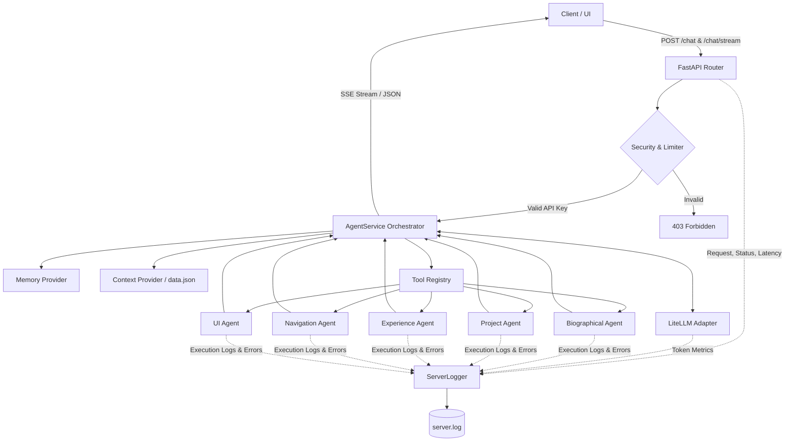

# Walter AI Backend

FastAPI backend service acting as a multi-agent orchestrator (ReAct pattern) to query and navigate Walter Ambriz's portfolio data. Uses LiteLLM for flexible integration with various language models (Groq, OpenAI, Anthropic, etc.).

<p align="center">
  
  
  
  
  
</p>

---

## 1. System Architecture

The execution flow separates controllers (HTTP/SSE), business logic (domain services and models), and infrastructure adapters for external APIs or persistence (Hexagonal Architecture):



---

## 2. Project Structure

```text
walter-ai/
├── app/
│   ├── adapters/       # API controllers, data loaders, and LLM clients
│   ├── config/         # YAML configuration files (config.yml)
│   ├── core/           # Environment setup, security, dependencies, and logging
│   ├── data/           # Portfolio data (data.json) and project assets
│   ├── domain/         # Pydantic models and the orchestrator service
│   ├── templates/      # Chat testing UI (chat_ui.html)
│   └── tools/          # Agent tool definitions and registry (CV Tools)
├── tests/              # Unit and integration test suite
├── main.py             # FastAPI entry point
├── Makefile            # Automation commands
└── pyproject.toml      # Dependency management with uv
```

---

## 3. Agents & Tools

The orchestrator uses specialized Python tools to address user queries:

| Agent / Tool | Function |
| :--- | :--- |
| `get_personal_info` | Retrieves biographical, academic, and contact information. |
| `get_projects_list` | Lists all portfolio projects. |
| `get_project_by_slug` | Retrieves details for a specific project. |
| `search_projects` | Searches projects matching tech stack or keywords. |
| `get_experience_info` | Retrieves work history and experience details. |
| `trigger_navigation` | Instructs the frontend to redirect the UI to a specific section or project. |
| `highlight_element` | Instructs the frontend to highlight a specific visual element on the screen. |

LLM models and inference temperature are configured dynamically in `app/config/config.yml` (defaults to `groq/meta-llama/llama-4-scout-17b-16e-instruct`).

---

## 4. API Endpoints

All endpoints require the `X-API-KEY` header for authentication and rate limiting.

### Standard Chat
* **`POST /api/v1/chat`**
  * **Request payload:**
    ```json
    {
      "query": "Show Walter's projects",
      "session_id": "optional-uuid",
      "action": "chat",
      "history": [],
      "context": {
        "url": "http://localhost:4200/home",
        "page": "home",
        "project_slug": null
      }
    }
    ```
  * **Response:**
    ```json
    {
      "message": "Here are the projects...",
      "actions": []
    }
    ```

### Streaming Chat (SSE)
* **`POST /api/v1/chat/stream`**
  * **Request payload:** Same format as standard chat.
  * **Response:** Server-Sent Events (SSE) stream.
    ```text
    data: {"message": "Here ", "actions": []}
    data: {"message": "are the ", "actions": []}
    ```

### Portfolio Data and Assets
* **`GET /api/v1/data`**
  * Returns the raw JSON containing all structured portfolio data.
* **`GET /api/v1/assets/{project_name}/{image_name}`**
  * Securely serves specific project images and assets.

---

## 5. Security & Guardrails

The system applies input validation before sending queries to the LLM:
* **Length Limit:** User queries are capped at 300 characters.
* **Prompt Injection Filter:** Regular expressions that block prompt evasion keywords (e.g., "forget rules", "act as").
* **Format Anomalies:** Payload blocking for excessive special characters (`{}`, `[]`, `<>`) to prevent template injections.

---

## 6. Setup & Development

### Install dependencies:
```bash
make install
```

### Run local development server (hot-reload):
```bash
make dev
```

### Environment Variables (`.env`):
Create a `.env` file in the root directory:
```env
API_KEY=your_secret_token
GROQ_API_KEY=your_groq_api_key
OPENAI_API_KEY=your_openai_api_key_optional
ANTHROPIC_API_KEY=your_anthropic_api_key_optional
```

### LLM Configuration (`app/config/config.yml`):
```yaml
llm:
  model: groq/meta-llama/llama-4-scout-17b-16e-instruct
  temperature: 0.5
```

### Run Tests:
```bash
PYTHONPATH=. make test
```

### Run LLM Evaluation Pipeline:
To run the automated LLM response validation and navigation action checks:
```bash
uv run python scripts/evaluator.py
```
This script evaluates the model against the test dataset defined in `scripts/eval_dataset.json` (testing navigation actions, data accuracy, and guardrails). It uses a Groq model as an LLM-as-a-judge to grade the outputs, and generates a markdown summary report saved to `eval_report.md`.

---

## License

Proprietary software developed by Walter Ambriz. All rights reserved.
