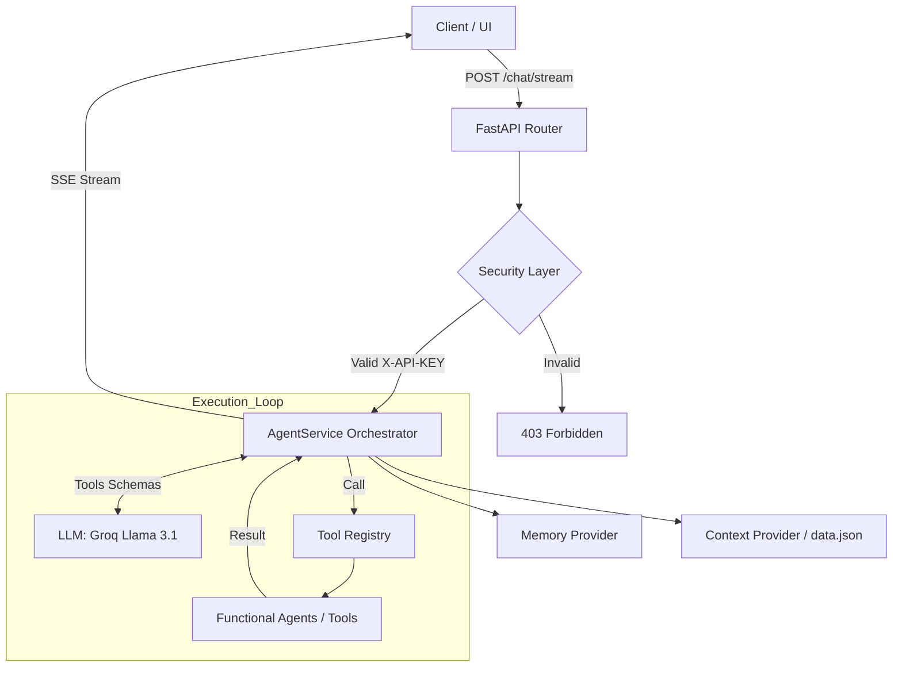
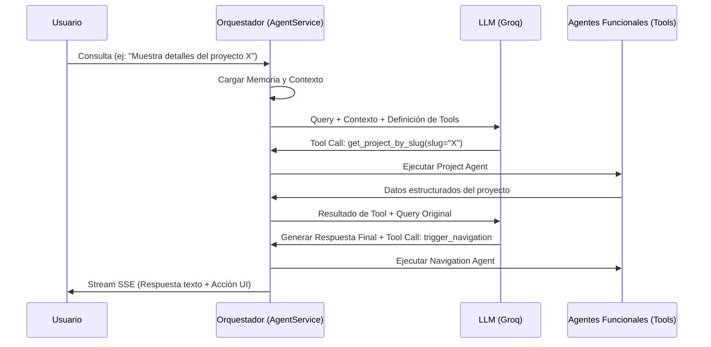

# WALTER-AI

> **Motor de orquestación multiagente asíncrono** diseñado para actuar como una interfaz inteligente entre usuarios y un repositorio de datos profesionales estructurados. Implementa una arquitectura basada en el patrón **ReAct (Reasoning and Acting)** con FastAPI y Groq.

---

## Stack Tecnológico Principal

<p align="left">
  
  
  
  
  
  
</p>

---

## Tabla de Contenidos

- [1. Introducción Técnica](#1-introducción-técnica)
- [2. Arquitectura del Sistema](#2-arquitectura-del-sistema)
- [3. Estructura del Proyecto](#3-estructura-del-proyecto)
- [4. Especificación de Agentes](#4-especificación-de-agentes)
- [5. Diagrama de Interacción](#5-diagrama-de-interacción)
- [6. Capa de Seguridad y Guardrails](#6-capa-de-seguridad-y-guardrails)
- [7. Documentación de Endpoints](#7-documentación-de-endpoints)
- [8. Configuración y Despliegue](#8-configuración-y-despliegue)
- [9. Licencia](#9-licencia)

---

## 1. Introducción Técnica

WALTER-AI es un backend de alto rendimiento desarrollado con **FastAPI**. Su propósito principal es la resolución de consultas complejas mediante la descomposición funcional de tareas, permitiendo que un orquestador central coordine agentes especializados en la recuperación de información y ejecución de acciones en tiempo real (por ejemplo, navegaciones automáticas en la UI del portafolio).

> [!NOTE]
> Toda la lógica corre bajo un flujo asíncrono optimizado mediante el gestor de paquetes de alto rendimiento `uv`.

---

## 2. Arquitectura del Sistema

El flujo de ejecución separa la capa de transporte, la capa de razonamiento y el proveedor de datos:



---

## 3. Estructura del Proyecto

```text
walter-ai/
├── app/
│   ├── api/            # Endpoints y definición de rutas FastAPI
│   ├── core/           # Configuración, prompts del sistema y cargador de datos
│   ├── data/           # Repositorio de datos estructurados (data.json)
│   ├── models/         # Modelos y esquemas de validación de Pydantic
│   ├── providers/      # Proveedores de servicios (LLM y Groq Client)
│   ├── services/       # Lógica central del Orquestador del Agente
│   ├── templates/      # Plantillas HTML de prueba (chat_ui.html)
│   └── tools/          # Registro y lógica individual de herramientas (CV Tools)
├── tests/              # Suite de pruebas unitarias y de integración
├── main.py             # Punto de entrada principal de la aplicación
├── Makefile            # Tareas de automatización comunes
└── pyproject.toml      # Configuración de dependencias y herramientas
```

---

## 4. Especificación de Agentes

El sistema mapea agentes especializados como herramientas (tools) registradas en el orquestador:

| Agente                 | Rol Específico                                       | Modelo (LLM)     | Herramientas Asociadas                                        |
| :--------------------- | :--------------------------------------------------- | :--------------- | :------------------------------------------------------------ |
| **Biographical Agent** | Datos biográficos, académicos y de contacto.         | Llama 3.1 70B/8B | `get_personal_info`                                           |
| **Project Agent**      | Consulta técnica y búsqueda en el portafolio.        | Llama 3.1 70B/8B | `get_projects_list`, `get_project_by_slug`, `search_projects` |
| **Experience Agent**   | Recuperación y análisis de historial laboral.        | Llama 3.1 70B/8B | `get_experience_info`                                         |
| **Navigation Agent**   | Control de redirección de la interfaz gráfica.       | Llama 3.1 70B/8B | `trigger_navigation`                                          |
| **UI Agent**           | Manipulación de elementos visuales (foco/highlight). | Llama 3.1 70B/8B | `highlight_element`                                           |

---

## 5. Diagrama de Interacción

El ciclo ReAct asíncrono interactúa de la siguiente manera:



---

## 6. Capa de Seguridad y Guardrails

Antes de realizar llamadas a los LLMs, el motor valida de forma estricta las entradas para mitigar abusos:

- **Filtro contra Inyecciones (Prompt Injection):** Expresiones regulares acotadas por límites de palabra (`\b`) bloquean patrones de desborde de reglas (_"forget rules"_, _"act as..."_) sin generar falsos positivos en palabras clave válidas como _"contactar"_.
- **Restricción de Longitud:** Limita la consulta a **300 caracteres** para prevenir desbordamiento de contexto deliberado.
- **Limpieza de Formato:** Intercepta el uso excesivo de caracteres especiales (`{}`, `[]`, `<>`) para bloquear inyecciones de plantillas.
- **Saneamiento de Parámetros:** Normaliza de forma transparente los argumentos nulos del LLM (ej. `"null"` en JSON) convirtiéndolos a `{}` antes de invocar las herramientas de Python.

---

## 7. Documentación de Endpoints

El sistema expone una API RESTful autodocumentada bajo el estándar OpenAPI.

### Chat y Streaming

- **`POST /api/v1/chat/stream`**
  - **Propósito:** Stream de respuestas utilizando SSE.
  - **Encabezados Requeridos:** `X-API-KEY` (para autenticación y Rate Limit).

> [!IMPORTANT]
> Todas las peticiones al endpoint de chat requieren el encabezado `X-API-KEY` para validar la identidad del cliente y aplicar políticas de Rate Limiting.

<details>
<summary><b>Ver estructura del payload (Request Body)</b></summary>

```json
{
  "query": "Como puedo contactar a Walter?",
  "session_id": "973884a3-3c5e-4004-86fb-21057f198a35",
  "context": {
    "page": "home",
    "project_slug": null
  }
}
```

</details>

<details>
<summary><b>Ver ejemplo de respuesta de Stream (SSE Chunks)</b></summary>

```text
data: {"message": "Puedes contactar a ", "actions": []}

data: {"message": "Walter a través de su correo...", "actions": []}
```

</details>

### Activos del Portafolio

- **`GET /api/v1/assets/{path:path}`**
  - **Propósito:** Distribución protegida de imágenes y assets.
  - **Seguridad:** Requiere validación de token.

---

## 8. Configuración y Despliegue

### Requisitos Previos e Instalación

El proyecto utiliza `uv` para garantizar la reproducibilidad y rapidez del entorno virtual:

```bash
# Sincronizar e instalar dependencias
make install
```

### Ejecución de Pruebas

Valida la suite de pruebas unitarias y de integración del backend:

```bash
make test

# Ejecución manual alternativa:
PYTHONPATH=. uv run pytest tests/
```

### Variables de Entorno

Crea un archivo `.env` en la raíz del proyecto basándote en `.env.example`:

```env
GROQ_API_KEY=tu_groq_api_key
API_KEY=tu_token_secreto_para_la_api
```

> [!TIP]
> Si deseas desplegar en **Vercel**, asegúrate de sincronizar primero el archivo de requerimientos estándar:
>
> ```bash
> make export
> ```

---

## 9. Licencia

Software propietario desarrollado por **Walter Ambriz**. Todos los derechos reservados.
