# 🤖 WALTER_AI_API // Neural Core

[](https://fastapi.tiangolo.com/)
[](https://www.python.org/)
[](https://groq.com/)

**WALTER_AI_API** is the high-performance AI core powering Walter Ambriz's interactive portfolio. It implements a Master Orchestrator with advanced tool-use capabilities to retrieve precise, secure, and context-aware data.

---

## 🏗️ System Architecture & Flow

```mermaid
%%{init: {
  'theme': 'base',
  'themeVariables': {
    'primaryColor': '#1a1a1a',
    'primaryTextColor': '#c9d1d9',
    'primaryBorderColor': '#30363d',
    'lineColor': '#444c56',
    'secondaryColor': '#0d1117',
    'tertiaryColor': '#161b22',
    'mainBkg': '#0d1117',
    'nodeBorder': '#30363d',
    'clusterBkg': '#0d1117',
    'clusterBorder': '#30363d',
    'fontSize': '14px'
  }
}}%%

graph LR
    %% Nodes
    User([User])
    Auth[[Security Shield]]
    Core{{WALTER_AI Core}}
    LLM(Llama 3.1)

    subgraph Agents [Specialized Data Agents]
        GH[GitHub]
        PR[Projects]
        EX[Experience]
        BI[Bio]
        NV[Navigation]
    end

    Out([Streaming SSE Output])

    %% Flow
    User -->|HTTPS| Auth
    Auth -->|Validated| Core
    Core -->|Prompt + Guardrails| LLM

    LLM -->|Function Calling| Agents

    GH & PR & EX & BI -->|JSON Context| LLM
    NV -.->|UI Action| Out

    LLM -->|Text Stream| Out

    %% Styling
    style User fill:#0d1117,stroke:#30363d
    style Out fill:#0d1117,stroke:#00E5FF,stroke-width:2px,color:#00E5FF
    style Core fill:#005571,stroke:#00E5FF,stroke-width:2px,color:#fff
    style LLM fill:#161b22,stroke:#30363d
    style Auth fill:#161b22,stroke:#30363d

    classDef agentNode fill:#161b22,stroke:#30363d,color:#c9d1d9
    class GH,PR,EX,BI,NV agentNode
    style NV stroke:#f85149,color:#f85149
```



---

## 🚀 Key Features

- **Multi-Agent Orchestration:** Router-Worker pattern to delegate tasks to specialized data agents.
- **Dynamic Tool-Use:** Real-time function execution across 5 specialized agents:
  - `get_github_activity`: Real-time coding streaks and repository events.
  - `get_projects_info`: Detailed technical stacks and project documentation.
  - `get_experience_info`: Professional career path and work history.
  - `get_personal_info`: Core skills, education, and contact metadata.
  - `trigger_navigation`: Direct UI control for seamless portfolio exploration.
- **Hybrid Streaming:** SSE (Server-Sent Events) for fluid, word-by-word responses.
- **Context-Aware Memory:** In-memory session management for coherent multi-turn dialogues.

## 🛡️ Trust & Safety (Guardrails)

The system integrates multi-layered security directly into the `SYSTEM_PROMPT` to ensure professional behavior:

- **Prompt Protection:** Shielded against injection attacks and instruction extraction attempts.
- **Topic Limitation:** Strictly focused on Walter Ambriz's career, tech stack, and projects.
- **Hallucination Prevention:** Relies exclusively on verified data from `cv_data.json`.
- **Quality Assessment:** Responses are processed by an independent `QualityGuard` service that scores conciseness, tone, and identity.

---

## 🛠️ Development Workflow

### Quick Start (cURL)

```bash
curl -X POST "http://localhost:8000/api/v1/chat" \
     -H "X-API-KEY: your_key" \
     -H "Content-Type: application/json" \
     -d '{"query": "Tell me about Walter experience", "session_id": "test_123"}'
```

### Setup

1. **Configuration:** `cp .env.example .env` and add your API keys.
2. **Installation:** `make install`
3. **Execution:** `make dev`
4. **Testing:** `make test`

---

## 📂 Project Structure

```text
.
├── app/
│   ├── api/v1/         # Endpoints and versioning
│   ├── core/           # Security, Prompts, and Config
│   ├── models/         # Pydantic Schemas
│   ├── services/       # Orchestration & Quality Logic
│   ├── tools/          # Specialized Data Agents
│   └── providers/      # LLM Gateways
├── tests/              # Pytest Suite
└── prompt.md           # Visual Identity Guide (AI Prompts)
```

---

_Architected for high-performance AI integration // Walter Ambriz_
