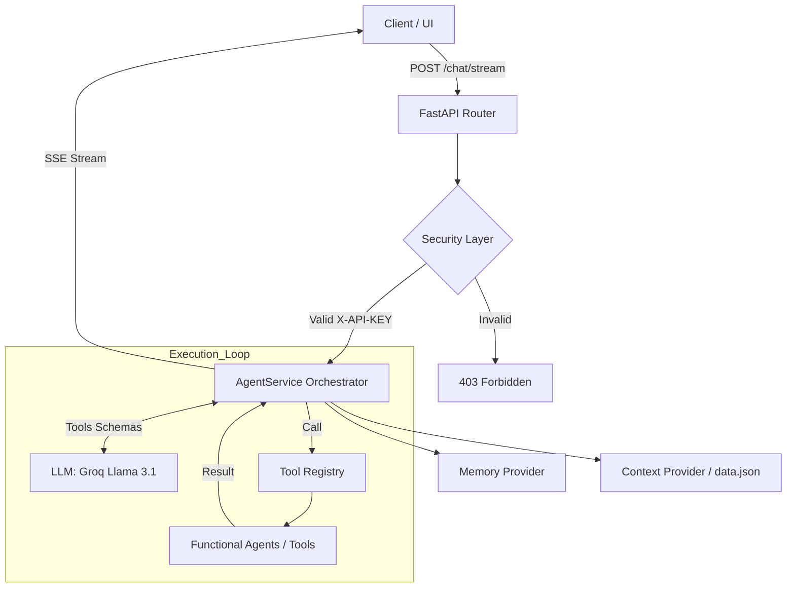
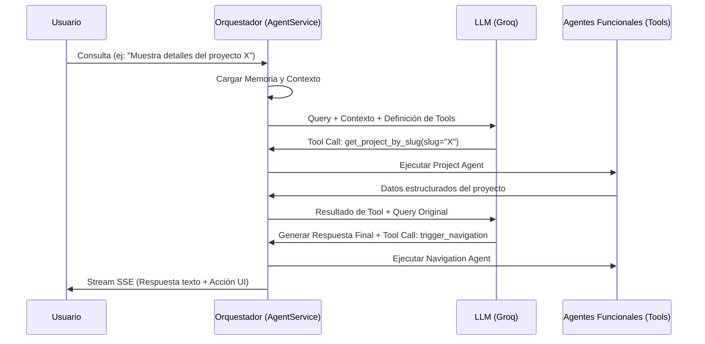

# WALTER_AI: Neural Core Engine

Documentación técnica del sistema de orquestación multiagente para la gestión de consultas de perfil profesional.

---

## 1. Introducción Técnica

WALTER_AI es un motor de backend desarrollado sobre el framework FastAPI, diseñado para actuar como una interfaz inteligente entre usuarios y un repositorio de datos profesionales estructurados. El sistema implementa una arquitectura de orquestación multiagente basada en el patrón ReAct (Reasoning and Acting). 

> [!NOTE]  
> Su propósito principal es la resolución de consultas complejas mediante la descomposición funcional de tareas, permitiendo que un orquestador central coordine agentes especializados en la recuperación de información y ejecución de acciones en la interfaz de usuario.

## 2. Arquitectura del Sistema

El flujo de ejecución se fundamenta en una segmentación clara entre la capa de transporte (FastAPI), la capa de razonamiento (Orquestador) y la capa de datos (Providers).



## 3. Especificación de Agentes

El sistema delega la lógica de negocio en agentes funcionales que operan como herramientas (tools) dentro del registro del orquestador.

| Agente | Rol Específico | Modelo (LLM) | Herramientas (Tools) |
| :--- | :--- | :--- | :--- |
| **Biographical Agent** | Extracción de datos personales, educación y contacto. | Llama 3.1 70B/8B | `get_personal_info` |
| **Project Agent** | Consulta técnica y búsqueda de proyectos en el portafolio. | Llama 3.1 70B/8B | `get_projects_list`, `get_project_by_slug`, `search_projects` |
| **Experience Agent** | Recuperación y análisis de historial laboral y roles. | Llama 3.1 70B/8B | `get_experience_info` |
| **Navigation Agent** | Control de flujo y redirección en la interfaz de usuario. | Llama 3.1 70B/8B | `trigger_navigation` |
| **UI Agent** | Manipulación de elementos visuales (highlighting). | Llama 3.1 70B/8B | `highlight_element` |

## 4. Diagrama de Interacción

La interacción entre agentes es coordinada por el `AgentService` mediante un ciclo de razonamiento iterativo.



## 5. Documentación de Endpoints

El sistema expone una API RESTful documentada bajo el estándar OpenAPI.

### Chat e Interacción
- **`POST /api/v1/chat/stream`**
  - **Propósito:** Inicio de conversación y streaming de respuestas.
  - **Esquema de entrada:** `ChatRequest` (query: string, session_id: string, context: optional).
  - **Respuesta:** `Server-Sent Events (SSE)` con fragmentos JSON.

> [!IMPORTANT]  
> Todas las peticiones al endpoint de chat requieren el encabezado `X-API-KEY` para validar la identidad del cliente y aplicar políticas de Rate Limiting.

### Gestión de Activos
- **`GET /api/v1/assets/{path:path}`**
  - **Propósito:** Entrega segura de imágenes y recursos de proyectos.
  - **Seguridad:** Requiere validación de token para acceso a recursos protegidos.

## 6. Stack Tecnológico


- **Core Framework:** FastAPI 0.115.0 (Gestión de asincronía nativa).
- **Gestión de Dependencias:** [uv](https://github.com/astral-sh/uv) (Entorno determinista de alto rendimiento).
- **Inference Gateway:** Groq SDK para modelos Llama 3.1 (Latencia mínima).
- **Validación de Datos:** Pydantic v2 para modelado de datos estricto.
- **Seguridad:** SlowAPI para control de tráfico (Rate limiting).

## 7. Configuración y Despliegue

### Instalación de Dependencias
El proyecto utiliza `uv` para garantizar la reproducibilidad del entorno.
```bash
make install
```

### Variables de Entorno
Es imperativo configurar el archivo `.env` con las siguientes claves:

| Variable | Descripción |
| :--- | :--- |
| `GROQ_API_KEY` | Credencial de acceso a la API de Groq Cloud. |
| `API_KEY` | Token secreto definido por el administrador para asegurar la API. |

> [!TIP]  
> Puede utilizar el archivo `.env.example` como plantilla para su configuración local.

### Preparación para Producción (Vercel)
Debido a que Vercel utiliza el estándar `requirements.txt`, es necesario sincronizar las dependencias antes del despliegue:

```bash
make export
```

## Licencia

Software propietario desarrollado por Walter Ambriz. Todos los derechos reservados.
