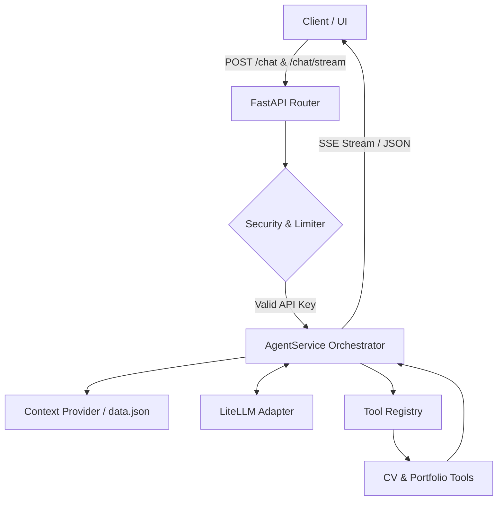

# Walter AI - Technical Summary & Cloud Deployment Strategy

This document serves as a comprehensive system summary and architectural blueprint for **Walter AI**, a FastAPI-based multi-agent orchestrator backend. It is designed to assist cloud engineers and system architects in selecting the optimal cloud deployment topology.

---

## 1. Project Overview & Architecture

Walter AI functions as an intelligent backend layer that queries and navigates portfolio data using a multi-agent system based on the **ReAct (Reasoning and Acting) pattern**. 

### Architectural Highlights
- **Hexagonal Design:** The application isolates controllers (API routes), core business logic (orchestration service), and infrastructure adapters (data storage, LLM connectors).
- **Multi-Agent Orchestration:** Driven by `AgentService`, which dynamically selects and executes domain-specific Python tools depending on the user query.
- **LLM Independence:** Utilizes `LiteLLM` to wrap inference providers (Groq, OpenAI, Anthropic) without rewriting downstream tool integrations.
- **Persistent execution path:** Runs as a persistent containerized process with SQLite audit database logging and Prometheus telemetry instrumentation.



---

## 2. Technology Stack

| Component | Technology | Role |
| :--- | :--- | :--- |
| **Language Runtime** | Python 3.13 | High-performance, modern async runtime. |
| **Framework** | FastAPI 0.115.0 | Async web routing, built-in OpenAPI docs, SSE support. |
| **LLM Gateway** | LiteLLM | Model abstraction (Groq, OpenAI, Anthropic). |
| **Database** | SQLite + SQLAlchemy (aiosqlite) | Local storage for session tracking & tool metrics. |
| **Security & Limits** | SlowAPI (Rate Limiter) + API Key | Core guardrails, request throttling. |
| **Observability** | Prometheus Client & Instrumentator | Scrape-ready system metrics exporter. |
| **Package Manager** | `uv` | Modern, ultra-fast Python package dependency manager. |

---

## 3. Deployment Constraints & Prerequisites

Before deploying Walter AI to a production environment, several critical architectural dependencies must be planned:

### 1. Database Persistence (SQLite vs. Remote DB)
- **Local SQLite (`audit.db`):** Requires a persistent block storage volume. If deployed to ephemeral storage (e.g. serverless containers without volume mounts), the database will reset on scale-down or container recycling.
- **Production Migration:** For highly available and scaled serverless or multi-instance container environments, replace the SQLite connection URL with an external database URL (such as PostgreSQL on Supabase or Neon.tech) to centralized audit metrics.

### 2. SSE Streaming Support
- The endpoint `POST /api/v1/chat/stream` utilizes **Server-Sent Events (SSE)**.
- Cloud solutions must support long-lived HTTP responses. Some API gateways or proxies (e.g., AWS API Gateway, certain Cloudflare configurations) have timeout limits or enforce response buffering, which breaks streaming chunks.

### 3. Secrets Management
The following environmental variables are required for deployment:
- `API_KEY`: API token required in header `X-API-KEY` for requests.
- `GROQ_API_KEY`, `OPENAI_API_KEY`, `ANTHROPIC_API_KEY`: Keys matching the desired LLM backend.

---

## 4. Configuration Files

Below are the configuration and setup files defined in the project codebase.

### 1. Containerization Specification (`Dockerfile`)
```dockerfile
# Stage 1: build deps with uv
FROM python:3.13-slim AS builder

WORKDIR /app

# Install uv
COPY --from=ghcr.io/astral-sh/uv:latest /uv /usr/local/bin/uv

# Copy dependency files first (layer cache)
COPY pyproject.toml .
COPY requirements.txt* ./

# Install dependencies into /app/.venv
RUN uv sync --no-dev --frozen 2>/dev/null || uv sync --no-dev

# Stage 2: runtime image
FROM python:3.13-slim AS runtime

WORKDIR /app

# Copy venv from builder
COPY --from=builder /app/.venv /app/.venv

# Copy application code
COPY main.py .
COPY app/ app/

# Use venv python
ENV PATH="/app/.venv/bin:$PATH" \
    PYTHONUNBUFFERED=1 \
    PYTHONDONTWRITEBYTECODE=1

EXPOSE 8000

CMD ["uvicorn", "main:app", "--host", "0.0.0.0", "--port", "8000"]
```

### 2. Orchestration & Monitoring Setup (`docker-compose.observability.yml`)
```yaml
services:
  api:
    build:
      context: .
      dockerfile: Dockerfile
    container_name: walter-api
    ports:
      - "8000:8000"
    env_file:
      - .env
    volumes:
      - ./app/config/config.yml:/app/app/config/config.yml:ro
      - audit-data:/app/audit-data
    environment:
      - AUDIT_DB_PATH=/app/audit-data/audit.db
    restart: unless-stopped
    healthcheck:
      test: ["CMD", "python", "-c", "import urllib.request; urllib.request.urlopen('http://localhost:8000/health')"]
      interval: 30s
      timeout: 5s
      retries: 3

  prometheus:
    image: prom/prometheus:latest
    container_name: walter-prometheus
    ports:
      - "9090:9090"
    volumes:
      - ./prometheus.yml:/etc/prometheus/prometheus.yml:ro
    depends_on:
      - api
    restart: unless-stopped

  grafana:
    image: grafana/grafana:latest
    container_name: walter-grafana
    ports:
      - "3000:3000"
    environment:
      - GF_SECURITY_ADMIN_PASSWORD=${GF_ADMIN_PASSWORD:-admin}
      - GF_USERS_ALLOW_SIGN_UP=false
    volumes:
      - ./grafana/provisioning:/etc/grafana/provisioning:ro
      - grafana-data:/var/lib/grafana
    depends_on:
      - prometheus
    restart: unless-stopped

volumes:
  grafana-data:
  audit-data:
```

---

## 5. Cloud Deployment Architecture Options

### Option A: Container-Based PaaS (Railway / Fly.io / Render)
*Optimized for rapid deployment, ease of maintenance, and native Dockerfile support.*

- **Service Layer:**
  - Builds dynamically using the repository's `Dockerfile`.
- **Database Layer:**
  - Mounts a persistent volume (e.g., Fly Volumes or Railway Volume) to mount `/app/audit-data` to preserve the SQLite database across restarts.
- **Observability:**
  - Prometheus and Grafana are easily run as supplementary services in the same network or metrics can be forwarded to dashboard providers.
- **Pros:** Full support for long-running SSE connections, simple persistent disk configuration for SQLite, minimal deployment configuration.
- **Cons:** Moderate non-zero monthly baseline cost.

### Option B: Managed Containers (AWS ECS Fargate / GCP Cloud Run)
*Recommended for production enterprise setups. Balances container abstraction with persistent logging.*

- **Service Layer:**
  - Runs the dockerized container on managed Fargate / Cloud Run.
- **Database Layer:**
  - ECS tasks run with attached persistent volume (e.g. AWS EFS) to persist the SQLite database, or connect to a managed external PostgreSQL instance.
- **Observability:**
  - Runs Prometheus & Grafana sidecar containers or forwards metrics to AWS CloudWatch / GCP Cloud Monitoring.
- **Pros:** High availability, robust security controls, full support for async SSE streams.
- **Cons:** Complex configuration setup, higher cost floor.

### Option C: Self-Hosted VM (AWS EC2 / GCP Compute Engine / DigitalOcean)
*Optimized for complete control, monitoring parity, and single-server deployments.*

- **Deployment Orchestration:**
  - Utilizes the predefined docker-compose config file to spin up API, Prometheus, and Grafana containers.
- **Pros:** Lowest third-party service overhead; configuration identical to staging/local compose environment.
- **Cons:** Direct patching, server hardening, and OS lifecycle management required.
